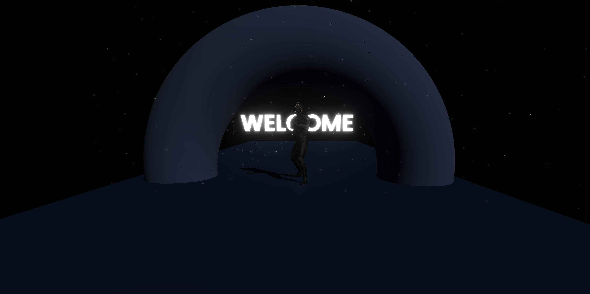

# Three.js Character High Kick Animation and Torus Knot Project 

This project demonstrates a **character executing a high kick animation** in **Three.js**, along with a **rotating Torus Knot**. The Torus Knot geometry was inspired by the project found on CodePen: [Torus Knot by enesser](https://codepen.io/enesser/pen/NWeQzP).



## Features 🌟
- **3D Character High Kick Animation**: A character model performs a high kick animation using Three.js's animation system.
- **Rotating Torus Knot**: A customizable and rotating Torus Knot geometry inspired by the project on CodePen.
- **Dynamic Background**: An animated background with particle effects for added visual appeal.
- **Post-Processing Effects**: Utilizes `EffectComposer`, `RenderPass`, and `UnrealBloomPass` to enhance the scene with bloom effects and post-processing.

## Installation 🛠️

1. **Clone this repository**:
   ```bash
   git clone <repository-url>
   cd <project-folder>

## Main elements of the project Structure 📂

- **`index.html`**: Basic HTML structure to host the Three.js scene.
- **`main.js`**: Initializes the Three.js scene, camera, renderer, and controls.
- **`torusknot.js`**: Contains the code for creating the Torus Knot geometry and particle system.
- **`animation.js`**: Manages the animation loop, including the character's high kick animation and the background particle system.
- **`background.js`**: Handles the creation and animation of the background and particles.
- **`dynamicbackground.js`**: Optionally used for creating dynamic background effects like color changes.
- **`model.js`**: Manages the loading of the animated skeleton.
- **`text.js`**: Contains the code for creating 3D text within the scene.


## Usage 🚀

### Character High Kick Animation 🦵
The character's animation is controlled by **Three.js's AnimationMixer**, which allows smooth transitions and animations. The **high kick animation** is applied to the character model, and you can modify its speed and keyframes through the animation system.

### Torus Knot 🔄
The **Torus Knot** geometry is created using `THREE.TorusKnotGeometry` and rendered as a particle system. This feature is inspired by the original **Torus Knot CodePen project**. You can customize parameters such as the **radius**, **tube size**, and **number of segments** through the **GUI**, enabling real-time updates to the geometry.

### Dynamic Background 🌌
The **background** consists of a large plane that changes color dynamically, with an added **particle system** that rotates to create a sense of depth. This is achieved through a custom shader for the background plane and the particle system, making it visually interactive.

### Post-Processing 🌟
**Post-processing effects** such as **bloom** are applied to the scene using **EffectComposer**. This adds a glowing effect around bright areas, enhancing the visual appeal.

## Controls 🎮

- **Camera Controls**: Use **mouse** or **touch input** to navigate the scene and explore the 3D environment.

## Dependencies 📦

- **Three.js**: A 3D graphics library for rendering the scene.
- **Post-processing**: To add visual effects such as bloom and enhanced rendering.

## Inspiration 💡

### Torus Knot Geometry
The **Torus Knot** geometry was inspired by the **CodePen project** by **enesser**: https://codepen.io/enesser/pen/NWeQzP, which features a rotating Torus Knot rendered as a particle system. The geometry has been adapted to fit into this **Three.js project** with additional particle system effects.
